<h1>
  
  Sanchar
</h1>

Smart Tourist Safety & Incident Response System

[](#)
[](#)
[](#)
[](#)
[](#)
[](#)
[](#)
[](https://sancharr.netlify.app/)
[](#)

A modern, responsive platform that helps tourists stay safe across India with real‑time alerts, multilingual assistance, family tracking, safe routing, e‑FIR guidance, local guides, and more.  
Built with React, TypeScript, Vite, and TailwindCSS. Selected in internal rounds for Smart India Hackathon (SIH).

---

## 📖 Contents (Quick Guide)

<table>
  <tr>
    <th>#</th><th>Section</th><th>What you’ll find</th>
    <th>#</th><th>Section</th><th>What you’ll find</th>
  </tr>
  <tr>
    <td>1</td>
    <td><a href="#what-is-sanchar-simple-explanation">What is Sanchar?</a></td>
    <td>Simple, non‑technical overview</td>
    <td>9</td>
    <td><a href="#tech-stack">Tech stack</a></td>
    <td>Badges + tools used</td>
  </tr>
  <tr>
    <td>2</td>
    <td><a href="#why-sanchar">Why Sanchar + Feasibility</a></td>
    <td>Problem, solution, impact, feasibility</td>
    <td>10</td>
    <td><a href="#tech-stack-implementation">Tech stack (Implementation details)</a></td>
    <td>How it works now + how to extend</td>
  </tr>
  <tr>
    <td>3</td>
    <td><a href="#highlights">Highlights</a></td>
    <td>Key features at a glance</td>
    <td>11</td>
    <td><a href="#project-structure">Project structure</a></td>
    <td>Repo layout</td>
  </tr>
  <tr>
    <td>4</td>
    <td><a href="#how-it-works-flow">How it works (Flow)</a></td>
    <td>Overview + separate Tourist/Officer flows</td>
    <td>12</td>
    <td><a href="#getting-started">Getting started</a></td>
    <td>ZIP method + install, run, build</td>
  </tr>
  <tr>
    <td>5</td>
    <td><a href="#features">Features</a></td>
    <td>Detailed feature list</td>
    <td>13</td>
    <td><a href="#how-to-use-in-60-seconds">How to use (60s)</a></td>
    <td>Tourist and Officer walkthroughs</td>
  </tr>
  <tr>
    <td>6</td>
    <td><a href="#quick-look-screens">Quick look (Screens + Live Demo)</a></td>
    <td>Screenshots and hosted link</td>
    <td>14</td>
    <td><a href="#roadmap">Roadmap</a></td>
    <td>What’s next</td>
  </tr>
  <tr>
    <td>7</td>
    <td><a href="#mobile-prototype">Mobile Prototype</a></td>
    <td>Clickable Figma + inline preview</td>
    <td>15</td>
    <td><a href="#acknowledgements">Acknowledgements</a></td>
    <td>Credits and thanks</td>
  </tr>
  <tr>
    <td>8</td>
    <td><a href="#routes-information-architecture">Routes</a></td>
    <td>App navigation map</td>
    <td>16</td>
    <td><a href="#license">License</a></td>
    <td>Usage terms</td>
  </tr>
</table>

---

## 🧭 What is Sanchar? (Simple explanation)

Sanchar is your digital safety companion while traveling in India.  
It shows important alerts, helps you find safer routes, connects you to helplines, supports multiple Indian languages, and lets your family know you’re safe. If needed, you can quickly raise an alert or get help with reporting incidents online.

---

## 💡 Why Sanchar ?

- Problem: Tourists struggle to find trustworthy, real‑time safety info and quick help in emergencies.
- Solution: One app that brings alerts, safer routes, helplines, language help, and family tracking together.
- Impact: Faster help, safer decisions, and peace of mind for travelers and families.

### 🛠️ Feasibility

- Technical: Built using proven web tech (React + TypeScript + Vite + TailwindCSS), responsive and fast. Frontend-first now; ready to connect APIs later.
- Integrations: Real-time alerts, safe-route risk layers, translation, and e‑FIR can be connected via public/government APIs when available.
- Scalability: Modular dashboards; can scale by plugging microservices and role-based access.
- Cost & Ops: Host on low-cost static providers (e.g., Vercel/Netlify). Backend can start serverless and grow with usage.
- Privacy & Safety: Only essential data required; can enforce encryption and role-based access when backend is added.

---

## ✨ Highlights

- Real‑time alerts with clear advice  
- Safe route guidance (concept UI; data pluggable)  
- Family tracking with live location and safety zones  
- Multilingual assistance (10+ Indian languages, UI‑ready)  
- Verified helpline directory  
- e‑FIR guidance flow  
- Officer dashboard for coordination  
- Global panic button available across the app

---

## 🔄 How it works (Flow)

Diagrams use top‑to‑bottom layout and highlight the main dashboards.

### Overview (Tourist + Officer)

```mermaid
flowchart TB
  %% Styles
  classDef highlightTourist fill:#FFE8D5,stroke:#F97316,stroke-width:2px,color:#7C2D12;
  classDef highlightOfficer fill:#DBEAFE,stroke:#2563EB,stroke-width:2px,color:#1E3A8A;
  classDef normal fill:#F3F4F6,stroke:#9CA3AF,color:#111827;

  %% Common entry
  S([Open App]):::normal --> H([Home]):::normal
  H --> TL([Tourist Login/Register]):::normal
  H --> OL([Officer Login/Register]):::normal

  %% Tourist branch (with contextual emojis)
  TL --> TD([Tourist Dashboard]):::highlightTourist
  TD --> QA([Quick Actions]):::normal
  QA --> A1([Alerts ⚠️]):::normal
  QA --> A2([Safe Route 🧭]):::normal
  QA --> A3([Family Tracking 👪]):::normal
  QA --> A4([Language Help 🗣️]):::normal
  QA --> A5([Helplines ☎️]):::normal
  QA --> A6([e‑FIR Guidance 📝]):::normal
  QA --> A7([Panic Button 🚨]):::normal
  A1 --> TA([Follow Actions]):::normal
  A2 --> TA
  A3 --> TA
  A4 --> TA
  A5 --> TA
  A6 --> TA
  A7 --> TA
  TA --> TEND([Stay Safe / Get Help]):::normal

  %% Officer branch (kept professional)
  OL --> OD([Officer Dashboard]):::highlightOfficer
  OD --> O3([Triage • Prioritize/Assign]):::normal --> O4([Respond • Contact/Guide/Dispatch]):::normal --> O5([Update • Notes/Timeline]):::normal --> O6([Close/Escalate]):::normal

  %% Coordination
  A6 -. incident details .-> OD
  A7 -. emergency ping .-> OD
  O4 -. guidance/actions .-> TEND
```


### Tourist workflow (focused)

```mermaid
flowchart TB
  classDef highlightTourist fill:#FFE8D5,stroke:#F97316,stroke-width:2px,color:#7C2D12;
  classDef normal fill:#F3F4F6,stroke:#9CA3AF,color:#111827;

  A([1. Open App]):::normal --> B([2. Home]):::normal --> L([3. Tourist Login/Register]):::normal --> D([4. Tourist Dashboard]):::highlightTourist
  D --> Q([5. Quick Actions]):::normal
  Q --> F1([6. Alerts ⚠️]):::normal
  Q --> F2([7. Safe Route 🧭]):::normal
  Q --> F3([8. Family Tracking 👪]):::normal
  Q --> F4([9. Language Help 🗣️]):::normal
  Q --> F5([10. Helplines ☎️]):::normal
  Q --> F6([11. e‑FIR Guidance 📝]):::normal
  Q --> F7([12. Panic Button 🚨]):::normal
  F1 --> R([Follow Recommended Actions]):::normal
  F2 --> R
  F3 --> R
  F4 --> R
  F5 --> R
  F6 --> R
  F7 --> R
  R --> Z([Stay Safe / Get Help]):::normal
```


### Officer workflow (focused)

```mermaid
flowchart TB
  classDef highlightOfficer fill:#DBEAFE,stroke:#2563EB,stroke-width:2px,color:#1E3A8A;
  classDef normal fill:#F3F4F6,stroke:#9CA3AF,color:#111827;

  A([Open App]):::normal --> B([Officer Login/Register]):::normal --> C([Officer Dashboard]):::highlightOfficer
  C --> D([Triage • Prioritize/Assign]):::normal --> E([Respond • Contact/Guide/Dispatch]):::normal --> F([Update • Notes/Timeline]):::normal --> G([Close or Escalate]):::normal

  X([Tourist Panic/Report 🚨]):::normal -. notification .-> C
```


---

## 🛡️ Features

- Digital ID: Simple profile to identify travelers securely  
- Real‑time Alerts: Safety, weather, and crowd updates with suggested actions  
- Safe Route: Conceptual safer‑path UI; external data can be integrated later  
- Family Tracking: Share live location, set safety zones, view movement history  
- Multilingual Assistance: 10+ Indian languages (UI prepared for translation)  
- Helplines: Quick access to verified emergency numbers  
- e‑FIR Guidance: Step‑by‑step help to report incidents online  
- Officer Portal: View reports, triage, and coordinate  
- Panic Button: Visible across the app for instant action

---

## 📱 Quick look (Screens)

Live Demo: [sancharr.netlify.app](https://sancharr.netlify.app/)

<table>
  <tr>
    <td align="center">
      
      <br/>Home Hero
    </td>
    <td align="center">
      
      <br/>Tourist Dashboard (1)
    </td>
    <td align="center">
      
      <br/>Tourist Dashboard (2)
    </td>
    <td align="center">
      
      <br/>Tourist Dashboard (3)
    </td>
  </tr>
  <tr>
    <td align="center">
      
      <br/>Officer Dashboard (1)
    </td>
    <td align="center">
      
      <br/>Officer Dashboard (2)
    </td>
    <td align="center">
      
      <br/>Officer Dashboard (3)
    </td>
    <td align="center">
      
      <br/>Officer Dashboard (4)
    </td>
  </tr>
</table>

---

## 📲 Mobile Prototype

<table>
  <tr>
    <td width="50%" valign="top">
      <p><a href="https://www.figma.com/proto/0wgO9Jsz0v4QC5Ypgks9ni/Sanchar?page-id=0%3A1&node-id=16-205&p=f&viewport=376%2C-125%2C0.09&t=8GYegGFaLbWy88Kx-1&scaling=scale-down&content-scaling=fixed&starting-point-node-id=13%3A21"><strong>Sanchar Figma Prototype →</strong></a></p>
      <p><sub>Experience the Sanchar mobile journey.</sub></p>
      <p><sub>- click the link above to explore and interact with the prototype on Figma.</sub></p>
    </td>
    <td width="50%" align="right" valign="top">
      
    </td>
  </tr>
</table>

---

## 🛣️ Routes (Information architecture)

- Public
  - `/` — Home (hero, features, stats)
  - `/about` — Platform overview
  - `/login` — Login
  - `/register/tourist`, `/register/officer` — Onboarding
- Tourist
  - `/dashboard/tourist` — Tourist hub
  - `/dashboard/language` — Multilingual assistance
  - `/dashboard/helplines` — Helpline directory
  - `/dashboard/safe-route` — Safer navigation UI
  - `/dashboard/lost-found` — Lost & found
  - `/dashboard/places` — Nearby places and attractions
  - `/dashboard/family-tracking` — Live tracking and zones
  - `/dashboard/e-fir` — e‑FIR guidance
  - `/dashboard/bookings` — Bookings
  - `/dashboard/contact-guide` — Local guides
- Officer
  - `/dashboard/officer` — Officer dashboard
- Fallback
  - `*` — 404 page with “Go Back”

---

## 🛠️ Tech stack

- Core  
  [](#)
  [](#)
  [](#)
  [](#)

- Routing & UX  
  [](#)
  [](#)
  [](#)
  [](#)

- Forms & Validation  
  [](#)
  [](#)

- Code Quality & Build  
  [](#)
  [](#)
  [](#)
  [](#)

---

## 💻 Tech stack (Implementation details)

- [](#) **React** + [](#) **TypeScript**
  - Now: Functional components with typed props/state; pages in `pages/`, reusable UI in `components/`.
  - Next: Feature folders (`features/alerts`) with co‑located UI/state/services; add React Query/SWR for data.

- [](#) **Vite**
  - Now: Fast dev server and optimized builds.
  - Next: Env configs (`.env.*`), path aliases (`@/`).

- [](#) **TailwindCSS**
  - Now: Utility‑first responsive styling.
  - Next: Design tokens, `@apply` component recipes, dark mode.

- [](#) **React Router**
  - Now: Public + dashboard routes; 404 fallback.
  - Next: Role‑based protected routes; lazy loaded chunks.

- [](#) **React Hook Form** + [](#) **Yup**
  - Now: Registration and dashboard forms with schema validation.
  - Next: Reusable inputs; async server validation.

- [](#) **Framer Motion**
  - Now: Library present; minimal use.
  - Next: Page transitions, list animations, micro‑interactions.

- [](#) **Lucide Icons**
  - Now: Consistent iconography.
  - Next: Centralized icon map.

- [](#) **React Hot Toast**
  - Now: Global toaster.
  - Next: `notify.ts` helpers for standard messages.

- [](#) **ESLint + TS ESLint**
  - Now: Linting via `npm run lint`.
  - Next: Pre‑commit hooks (Husky + lint‑staged), CI lint gate.

- [](#) **Deployment**
  - Now: Static deployment of Vite build (`dist/`) to Netlify.
  - Next: Preview deploys for PRs, environment secrets, and edge functions (if required).

- Backend/API (future)
  - Alerts feed, safe‑route scoring, e‑FIR helper, translation services via `src/services/*.ts`.

---

## 🗂️ Project structure

```text
.
├─ index.html
├─ package.json
├─ vite.config.ts
├─ tailwind.config.js
├─ postcss.config.js
├─ tsconfig*.json
├─ public/
│  └─ images/ (hero, tracking, logo, mobile prototype, landmarks)
└─ src/
   ├─ components/
   │  ├─ Navbar.tsx
   │  └─ PanicButton.tsx
   ├─ context/
   │  └─ AuthContext.tsx
   ├─ pages/
   │  ├─ Home.tsx
   │  ├─ About.tsx
   │  ├─ Login.tsx
   │  ├─ TouristRegistration.tsx
   │  ├─ OfficerRegistration.tsx
   │  ├─ TouristDashboard.tsx
   │  ├─ OfficerDashboard.tsx
   │  └─ dashboards/
   │     ├─ LanguageDashboard.tsx
   │     ├─ HelplinesDashboard.tsx
   │     ├─ SafeRouteDashboard.tsx
   │     ├─ LostFoundDashboard.tsx
   │     ├─ PlacesDashboard.tsx
   │     ├─ FamilyTrackingDashboard.tsx
   │     ├─ EFirDashboard.tsx
   │     ├─ BookingsDashboard.tsx
   │     └─ GuideDashboard.tsx
   ├─ App.tsx
   ├─ main.tsx
   └─ index.css
```

---

## 🚀 Getting started

Prerequisites
- Node.js 18+ and npm 9+

Run locally (ZIP method)
1. Download ZIP → extract.
2. Open a terminal in the project folder.
3. Install:
   ```bash
   npm install
   ```
4. Run:
   ```bash
   npm run dev
   ```
5. Open http://localhost:5173

Optional (Git)
```bash
git clone <your-repo-url>.git
cd <repo-folder>
npm install
npm run dev
```

Build & Preview
```bash
npm run build
npm run preview
```

---

## 📝 How to use (in 60 seconds)

### For Tourists (step‑by‑step)
1. Create your account (Tourist Login/Register).  
2. From the Tourist Dashboard, use Quick Actions:  
   - Alerts ⚠️: View live safety, weather, and crowd updates. Each alert includes severity, location, and recommended actions.  
   - Safe Route 🧭: Preview safer pathways to your destination. Concept UI; can be connected to risk data services later.  
   - Family Tracking 👪: Share your live location; define safety zones. Get notified on entry/exit.  
   - Language Help 🗣️: Get guidance in your preferred language (UI ready for i18n).  
   - Helplines ☎️: One‑tap call to verified emergency numbers based on your state/city.  
   - e‑FIR Guidance 📝: Follow structured steps to gather information and prepare for online FIR filing.  
   - Panic Button 🚨: Trigger immediate assistance workflow from any screen.  
3. Follow the action cards and on‑screen prompts until you see “Stay Safe / Get Help”.  
4. You can always return to Quick Actions or the Home page for new tasks.

### For Officers (step‑by‑step)
1. Login/Register as Officer.  
2. Inspect the Officer Dashboard overview: new/in‑progress/closed items.  
3. Open an item → triage priority → assign/self‑assign.  
4. Respond: contact tourist, share guidance or meeting point, and dispatch if needed.  
5. Update notes and status; close or escalate the case when done.  
6. Use filters to focus by severity, category (alerts, lost/found, language assist, medical), or time.

Pro tips
- Use the Panic Button only for urgent situations; it prioritizes your case to officers.
- Keep your profile info up to date to speed up verification.

---

## 🗺️ Roadmap

### Phase 1: Product polish and performance
- Implement micro-interactions; standardize iconography; enable dark mode option
- Enforce accessibility: keyboard navigation, ARIA roles, color-contrast compliance (WCAG AA)
- Optimize performance: route code-splitting, dashboard lazy-loading, image compression

### Phase 2: Data and intelligence
- Integrate alerts from official/state feeds with manual fallback
- Enable safe-route risk scoring (crime density, crowd levels, weather signals)
- Enhance family tracking: safety zone management, basic movement history
- Add analytics dashboards: alert categories, response trends, hotspot discovery

### Phase 3: Security and authorization
- Add role-based access control (Tourist/Officer) and protected routes
- Create immutable case logs (who/when/what) for auditability
- Apply privacy controls: data minimization, encryption, export/delete requests

### Phase 4: Communication and offline resilience
- Deliver notifications for critical events (push/email/SMS)
- Ship offline-first PWA: cache critical screens; queue panic/notes for retry

### Phase 5: Integrations and scale
- Provide e‑FIR assistance: export structured case notes to state portals
- Add language services: translation APIs; optional TTS/ASR
- Establish CI/CD with preview deployments; add error tracking and monitoring

### Success targets
- Time-to-interaction: < 5s on slow networks
- Panic acknowledgment SLA: ≥ 95%
- Accessibility: zero blocker issues (WCAG AA baseline)
- Stability: ≥ 99% crash‑free sessions

### Risks and mitigations
- External API outages → cached/backup data; manual override
- PII exposure risk → strict minimization, encryption, user export/delete tools
- Network instability → offline PWA with queued actions and background sync

---

## 👥 Team

| Name | Email | LinkedIn |
|------|-------|----------|
| G. Kalyan Srinivas | Kalyansrinivas444@gmail.com | [Profile](https://www.linkedin.com/in/kalyansrinivas-gurugubelli-755625377) |
| V. Yesu Babu | Veeramallayesubabu1@gmail.com | [Profile](https://www.linkedin.com/in/yesu-babu-veeramalla-4b2b5932a) |
| D. Geethika | geethikaadasari@gmail.com | [Profile](https://www.linkedin.com/in/geethikaa-dasari07) |
| K. Lohith | Kummarilohith05@gmail.com | [Profile](https://www.linkedin.com/in/lohith-kummari-053b5b32a) |
| Ch. Satwik | Satwikmani7@gmail.com | [Profile](https://www.linkedin.com/in/satwik-manikanta-769885217) |
| K.L.V.G. Harini | harini97443@gmail.com | [Profile](https://www.linkedin.com/in/harini-kayala-baab5932a) |

---

## 🙌 Acknowledgements

- Proudly built for and selected in internal rounds of Smart India Hackathon (SIH).
- Grateful to mentors, faculty coordinators, peers, and the wider open‑source community behind React, Vite, TailwindCSS, and companion libraries.
- Built end‑to‑end by the Sanchar team listed above.  

---


## 🤝 Contributions  
We welcome ideas and suggestions!  

- Fork this repository  
- Enhance the UI/UX  
- Add interactivity using JavaScript  
- Extend it further with a backend or new features  


---


## ⚖️ License & Usage 

All rights reserved © 2025 **Sanchar**  

This project is shared for **educational and demo purposes** as part of the SIH journey.  

You may:  
- View or run it locally for non-commercial use  

You may not:  
- Redistribute or use it commercially without permission  

For collaboration or licensing queries, contact us via the emails in the **Team** section.  

---
🌟 *Sanchar – because every journey should be safe and worry-free.*
---
